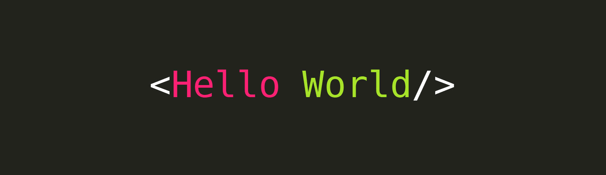

Hey there 👋!

I'm Lena, a beginner front-end developer. I make it my mission to translate user-focused designs into pixel-perfect websites or applications that run blazing fast.

 

## 📌 Pinned Repositories

 

 

 

 

 
 

## &#x1f4c8; GitHub Stats

 

 
 

## 💼 Skills

More Skills

 

 

 

 
